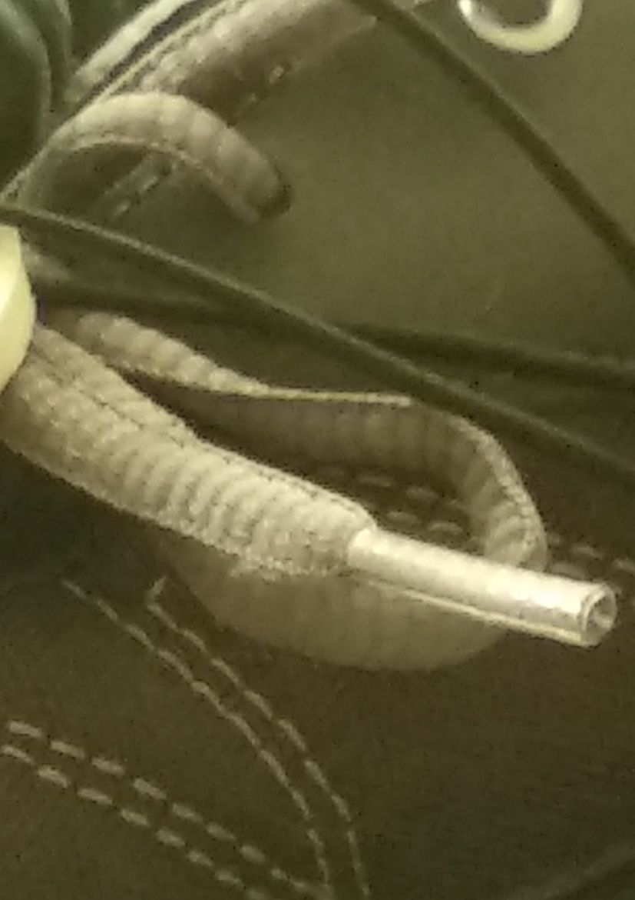

# WEarable seNsors unDer Shoes (WENDS)

WENDS is an open hardware and open software project created to monitoring temporal gait phases. Several solutions can be found in the market for monitoring temporal gait phases. However, they are expensive and impose location restrictions and/or major shoe modifications. In this project, three major requirements have been identified to solve these restrictions: 

1.- The solution should work on different shoe sizes with minimum modifications (insoles or in-built solutions are discarded).

2.- Wearable and wireless solutions: the solution should be used anywhere and with minimum user's disturbance (cables go up the lower-limbs are discarded).

3.- Cheap and easy to replicate! The sensors should be affordable in order to reduce the cost and to increase the number of end users.

To achieve these requirements, we have created a flexible and adjustable structure that attaches to the outsole front and back parts as figure 1 shows (req. 1). Static Dissipative foam was been used between two filaflex plastic covers to create a cheap and durable pressure sensor (req. 2,3). [Aconno ACN52832](https://aconno.de/products/acn52832/) board has been used to syncronize both shoes under 10 ms by using an external mobile Andriod phone (BLE) (req. 2).

This project borns at the [Biomedical Engineering group](http://www.es.mdh.se/research-groups/32-Biomedical_Engineering) under the research profile [Embedded Sensor Systems for Health](https://www.mdh.se/forskning/inriktningar/inbyggda-system/ess-h?l=en_UK). It is led by [Dr. Ballesteros](https://www.researchgate.net/profile/Joaquin_Ballesteros) and it counts with the collaboration of [Senior lecturer Dr. Martin Ekstrom](http://www.es.mdh.se/staff/177-Martin_Ekstrom) and [Prof. Dr. Maria Lindén](http://www.es.mdh.se/staff/114-Maria_Lind__n).

More information will be coming soon.

## Built With
* [Fusion 360](https://www.autodesk.com/products/fusion-360/overview) - The program used to to design the plastic pieces. All these documents have been exported to STEP file extension too. It is an ISO standard exchange format that can be openned by other programs, such as [FreeCAD](https://github.com/FreeCAD/FreeCAD).

* [MBED online compiler](https://os.mbed.com/handbook/mbed-Compiler) - The online program used to to programming the [Aconno microcontroller](https://aconno.de/products/acn52832/).

* [Android Studio](https://developer.android.com/studio/) - The program to create the mobile software.

## Components list (Under revision)
* [Aconno ACN52832](https://aconno.de/products/acn52832/)

## Contributors

* Swedish Knowledge Foundation (KKS) through the research profile [Embedded Sensor Systems for Health at Mälardalen University](https://www.mdh.se/forskning/inriktningar/inbyggda-system/ess-h?l=en_UK), Sweden - [Prof. Dr. Maria Lindén](http://www.es.mdh.se/staff/114-Maria_Lind__n).

## License

This project is licensed under the Creative Commons Attribution 4.0 - see the [LICENSE.md](https://github.com/joaquinballesteros/Smart-Cane/blob/master/LICENSE) file for details.

## Contact

joaquin.ballesteros@mdh.se

